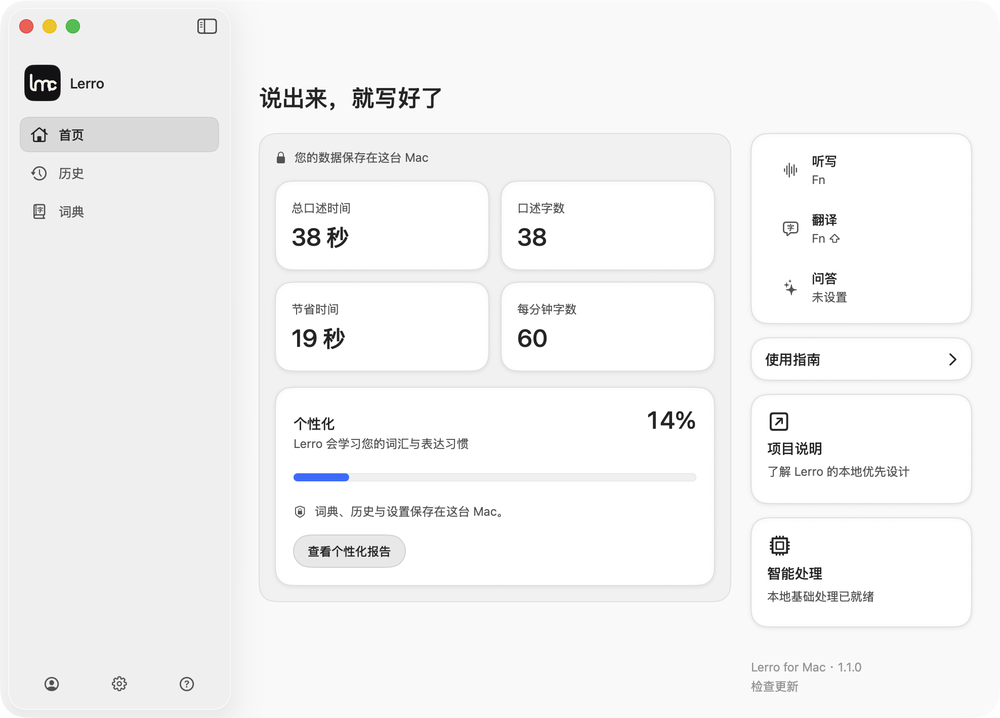
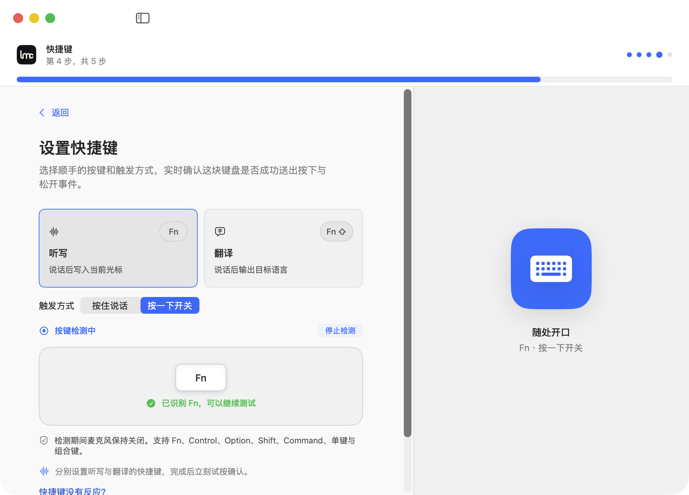

<p align="center">
  
</p>

<h1 align="center">Voice to text, native to Mac.</h1>

<p align="center">
  Lerro turns speech into text at your cursor with Apple Speech on macOS 26.<br>
  Fast, accurate, local-first, and open source.
</p>

<p align="center">
  <a href="https://updates.lerroapp.com/download/macos/latest"><strong>Download for macOS</strong></a>
  · <a href="https://lerroapp.com">Website</a>
  · <a href="https://lerroapp.com/changelog">Changelog</a>
</p>

<p align="center">
  Free forever · Apple silicon · macOS 26+
</p>



## Speak. Your Mac writes.

Press a shortcut, speak naturally, and keep working. Lerro uses Apple&apos;s native Speech framework to transcribe your voice, then places the result in the active Mac app.

- **Native and fast.** Apple Speech gives Dictate a direct path from microphone to cursor.
- **Private by architecture.** Lerro has no account system, subscription, product analytics, or telemetry. Audio saving is off by default.
- **Translation on your Mac.** Apple Translation turns speech into another language after the required language resources are installed.
- **Intelligence when you choose it.** Refine locally with an optional MLX model, or connect your own OpenAI-compatible API key.
- **Open from app to release.** Source, tests, privacy policy, release scripts, and website are public under Apache-2.0.

## One shortcut, three paths

| Path | Flow | Best for |
| --- | --- | --- |
| **Dictate** | Voice → Apple Speech → Cursor | The shortest native transcription path |
| **Translate** | Voice → Apple Speech → Apple Translation → Cursor | On-device multilingual writing |
| **Refine** | Transcript → Local MLX or BYOK → Cursor | Polish, rewrite, and Ask |



Shortcut setup detects the exact press and release events before onboarding completes. Lerro requests two macOS permissions: **Microphone** for the speech you choose to capture and **Accessibility** for global shortcuts and cursor delivery. Input Monitoring and a separate Speech Recognition permission are not requested.

## Local-first, with clear network boundaries

Core Dictate, Apple Translation, and optional local MLX processing work offline after their language resources or model are installed.

Network access is limited to explicit boundaries:

- Apple language-resource and optional model setup.
- Signed update checks and downloads.
- BYOK requests sent directly to the provider you configure, with only the context fields you enable.

Lerro&apos;s update service handles release metadata and downloads. It never receives audio, transcripts, or app context. Read the full [privacy model](PRIVACY.md) and [security policy](SECURITY.md).

## Download

[Download the latest signed and Apple-notarized build](https://updates.lerroapp.com/download/macos/latest), then move **Lerro.app** to Applications and complete the guided permission setup.

Requirements:

- Apple silicon Mac.
- macOS 26 or later.
- About 3.03 GB only when you approve the optional local MLX model.

Permanent downloads and concise release notes live in the [changelog](https://lerroapp.com/changelog). GitHub Releases mirrors the same public artifacts.

## Build from source

```zsh
swift build
swift test
./script/build_and_run.sh
```

The product architecture and contributor details live in:

- [Architecture](docs/architecture.md)
- [Core flow](docs/core-flow.md)
- [Build guide](docs/build.md)
- [Testing](docs/testing.md)
- [Contributing](CONTRIBUTING.md)

## License

Lerro source code is available under [Apache-2.0](LICENSE). Documentation and first-party screenshots use [CC BY 4.0](LICENSES/CC-BY-4.0.txt). The name and logo follow [TRADEMARKS.md](TRADEMARKS.md); third-party notices are recorded in [NOTICE](NOTICE) and [THIRD_PARTY_NOTICES.md](THIRD_PARTY_NOTICES.md).
