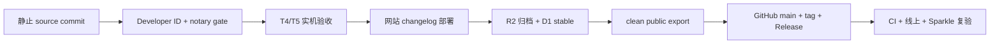

# 零历史接手与全链路交付

本目录让一个没有聊天历史的 Claude Code、Codex 或人工维护者，在当前仓库中完成“理解现状 → 开发 → 本地验证 → 真实系统验收 → 网站与 App 发布 → GitHub 镜像 → 线上复验”。

稳定规则位于 `AGENTS.md` 与专题文档，动态发布状态位于 [`current-state.md`](current-state.md)，发布机就绪检查位于 [`maintainer-readiness.md`](maintainer-readiness.md)。项目级 canonical Skill 位于 `.agents/skills/lerro-development/SKILL.md`。

## 前十五分钟

从仓库根目录运行：

```zsh
git status --short
git rev-parse --show-toplevel
git rev-parse HEAD
swift --version
xcode-select -p
sed -n '1,240p' AGENTS.md
sed -n '1,180p' docs/README.md
sed -n '1,140p' Package.swift
sed -n '1,240p' docs/handoff/current-state.md
./script/validate_agent_workspace.sh
```

随后使用 `rg` 定位受影响符号、调用者、测试和文档。源码、真实 Release 产物、系统状态与明确记录的发布证据共同支撑结论。

## 三类工作模式

| 模式 | 可执行范围 | 完成条件 |
| --- | --- | --- |
| 阅读、解释、审查、诊断 | 只读检查、构建信息采集、确定性复现 | 给出证据、根因、影响边界与建议；工作树保持原状 |
| 实现与本地验证 | 仓库改动、focused/full tests、本地 bundle、inert fixture | 代码、测试、文档和本地证据闭环；列出真实系统边界 |
| 发布 | 上述全部 + 公证、Cloudflare、GitHub、线上复验 | 用户明确要求发布；T4/T5、stable、mirror、CI 和公开 URL 全部形成证据 |

发布授权覆盖正常发布动作。凭据创建、账号权限变化、DNS 变化、版本撤回、对象删除和 TCC reset 继续单独确认。

## 事实路由

| 问题 | 权威入口 |
| --- | --- |
| target、依赖、平台 | `Package.swift`、`Package.resolved` |
| 生产组合 | `AppDependencies.live()` |
| capture 状态与交付 | `CaptureModels.swift`、`AppSession.swift`、[`../core-flow.md`](../core-flow.md) |
| Speech、Audio、热键、AX、TCC | `Sources/LerroMac`、[`../permissions.md`](../permissions.md)、[`../privacy-security.md`](../privacy-security.md) |
| 模型与 BYOK | `Sources/LerroIntelligence`、[`../models.md`](../models.md) |
| UI、HUD、Onboarding | `DesignTokens.swift`、共享组件、目标 Feature view、`Brand/`；私有工程树另有 `docs/ui-parity.md` |
| 测试与实机矩阵 | [`../testing.md`](../testing.md) |
| app bundle、签名、公证 | [`../build.md`](../build.md)、[`../release.md`](../release.md)、`script/` |
| 网站 | `site/README.md`、`site/package.json`、route tests |
| 更新分发 | `distribution/README.md`、ADR 0007、`publish_cloudflare_release.sh` |
| 公开源码 | [`../open-source/README.md`](../open-source/README.md)、allowlist、export 与 scanner |

私有研究证据、第三方对标快照、完整 release 证据、构建产物和本地维护配置不会进入公开 allowlist。公开仓库仍包含足以开发、测试、打包和理解发布架构的代码与文档。

## 标准开发循环

1. 把用户需求写成可观察验收条件。
2. 读取受影响模块与专题文档，画出调用链和数据所有权。
3. 运行最窄基线测试。筛选为空时使用 `swift test list` 查询真实名称。
4. 实现最小完整改动，保持 Core、Intelligence、Mac 和 App 的依赖方向。
5. 增加正常、失败、取消、竞态和旧数据边界测试。
6. 运行 focused tests 与完整门禁。
7. 生成与风险匹配的 fixture、真实 Release、TCC、硬件或网络证据。
8. 同步文档、隐私、CHANGELOG、站点文案、Release Notes 与 ADR。
9. 运行文档、Skill、公开导出和 diff 检查。
10. 报告已验证等级、命令、结果与剩余边界。

## 本地验证梯度

快速静态与 agent 入口：

```zsh
./script/validate_agent_workspace.sh
zsh -n Brand/scripts/*.sh script/*.sh script/*.zsh
plutil -lint \
  config/Info.plist \
  config/Lerro.entitlements \
  Sources/Lerro/Resources/PrivacyInfo.xcprivacy
swift package describe --type json
```

Swift 确定性验证：

```zsh
swift test --filter <affected-suite-or-test>
swift test
```

网站确定性验证：

```zsh
(
  cd site
  npm ci
  npm run lint
  npm run build
  npm test
  npm audit --omit=dev --audit-level=high
)
```

更新 Worker 确定性验证：

```zsh
(
  cd distribution
  npm run check
  npm test
)
```

真实 app bundle 与统一 Release gate：

```zsh
./script/build_and_run.sh --release --no-launch
LERRO_SIGNING_MODE=ad-hoc ./script/verify_release.sh
```

UI 使用 `LERRO_FIXTURE_MODE=1` 和 inert adapters。真实 Speech、麦克风、物理 Fn/Globe、Accessibility、剪贴板、焦点与跨应用写入使用最终 `.app` 按 `docs/testing.md` 的 T4 矩阵验证。

## 发布拓扑



任何节点失败都会停止后续公开动作。Cloudflare stable 仅在 R2 完整读回 SHA-256 后推进；GitHub Release 使用同一次 canonical 产物。

## 发布机准备

原维护工作区使用被忽略的 `config/maintainer.local.env` 保存非秘密标签与公开仓库工作树路径。新机器从模板创建：

```zsh
cp config/maintainer.env.example config/maintainer.local.env
chmod 600 config/maintainer.local.env
```

填完后加载并执行只读检查：

```zsh
source config/maintainer.local.env
./script/check_maintainer_readiness.sh --release --online
```

该文件只保存 profile/account 标签、公开 remote 和本地工作树路径。证书私钥、notary 凭据、Sparkle 私钥、Cloudflare token 与 GitHub token继续留在 Keychain 或各 CLI 的凭据存储中。

## App 公开发布

版本发布前更新：

- `config/Info.plist` 的 version/build。
- `CHANGELOG.md`。
- `site/app/changelog/releases.ts` 的双语条目与不可变下载 URL。
- 本版验收记录；可从 [`release-evidence-template.md`](release-evidence-template.md) 复制到被忽略的 `work/release-evidence/`。

提交并冻结 source tree 后：

```zsh
source config/maintainer.local.env
./script/check_maintainer_readiness.sh --release --online

LERRO_SIGNING_MODE=developer-id \
LERRO_NOTARY_PROFILE="$LERRO_NOTARY_PROFILE" \
LERRO_SPARKLE_KEY_ACCOUNT="$LERRO_SPARKLE_KEY_ACCOUNT" \
./script/verify_release.sh
```

完成受影响 T4/T5 行。随后先部署网站 changelog：

```zsh
(
  cd site
  npm run deploy
)
curl --fail --silent --show-error https://lerroapp.com/changelog >/dev/null
curl --fail --silent --show-error https://lerroapp.com/zh/changelog >/dev/null
```

网站公开可读后推进更新渠道：

```zsh
./script/publish_cloudflare_release.sh
```

脚本负责 Developer ID、公证、Sparkle 签名、R2 不可变 key、完整读回、D1 batch、appcast、latest 与 immutable ZIP 校验。命令成功后继续独立读取 manifest 与公开端点，记录版本、build、长度、签名和 SHA-256。

网站部署与最终复验覆盖四条语言路由：`/`、`/zh`、`/changelog`、
`/zh/changelog`。每条路由检查 HTTP 200、正确 `lang`、metadata、导航、语言匹配截图与下载链接；`www` 继续验证到 apex 的永久重定向。

## 同步公开 GitHub 仓库

源仓库保持私有工程历史；GitHub `Ryan-yang125/lerro` 保存 allowlist clean mirror。使用已有公开工作树延续其历史：

```zsh
source config/maintainer.local.env
./script/export_public_repo.sh --replace

rsync -ain --delete --exclude='.git/' \
  clean-public/lerro/ "$LERRO_PUBLIC_REPO_DIR/"
```

先人工审查 dry-run。确认后同步并扫描：

```zsh
rsync -a --delete --exclude='.git/' \
  clean-public/lerro/ "$LERRO_PUBLIC_REPO_DIR/"

LERRO_LICENSE_SOURCE="$PWD" \
  "$LERRO_PUBLIC_REPO_DIR/script/scan_public_repo.sh" \
  "$LERRO_PUBLIC_REPO_DIR"

git -C "$LERRO_PUBLIC_REPO_DIR" status --short
git -C "$LERRO_PUBLIC_REPO_DIR" diff --check
```

获得 GitHub 发布授权后提交与 push。文档和 agent-only 改动只推进 `main`。App 版本发布继续创建 annotated tag 和 Release：

```zsh
git -C "$LERRO_PUBLIC_REPO_DIR" add -A
git -C "$LERRO_PUBLIC_REPO_DIR" commit -m '<public change summary>'
git -C "$LERRO_PUBLIC_REPO_DIR" push origin main

version='<version>'
git -C "$LERRO_PUBLIC_REPO_DIR" tag -a "v$version" -m "Lerro v$version"
git -C "$LERRO_PUBLIC_REPO_DIR" push origin "v$version"

gh release create "v$version" \
  outputs/Lerro-macOS-arm64.zip \
  outputs/Lerro-macOS-arm64.dSYM.zip \
  outputs/Lerro-macOS-arm64.cdx.json \
  outputs/Lerro-release-manifest.json \
  outputs/SHA256SUMS.txt \
  --repo Ryan-yang125/lerro \
  --title "Lerro v$version" \
  --notes-file '<public-release-notes-file>'
```

五个 asset 必须来自同一次已经发布到 Cloudflare 的 canonical build。使用 GitHub API 读回名称、字节数与 digest，等待 `main` 和 tag CI，再确认 `releases/latest` 指向新版本。

## 文档与状态维护

- 长期不变量更新 `AGENTS.md` 与对应专题文档。
- 当前公开版本、Worker、release tag、CI 与人工边界更新 `current-state.md`。
- 新的环境变量、profile 标签和工作树约定更新配置模板与 `maintainer-readiness.md`。
- 发布流程变化同步更新 canonical Skill、`docs/release.md`、脚本和 CI。
- 任何 Skill 变化运行 `./script/validate_agent_workspace.sh` 和 skill validator，再做一次零上下文前向测试。
- 固定版本证据保存在私有工程树的 `docs/releases/` 或被忽略的 `work/release-evidence/`；公开 Release Notes 保持精炼并排除身份和凭据细节。

## 最终交付标准

交付说明独立包含改动、命令、测试结果、签名模式、产物、真实系统矩阵、Cloudflare、GitHub、CI、线上 URL 和剩余边界。用户无需读取聊天中的中间进度即可理解结果并继续工作。
